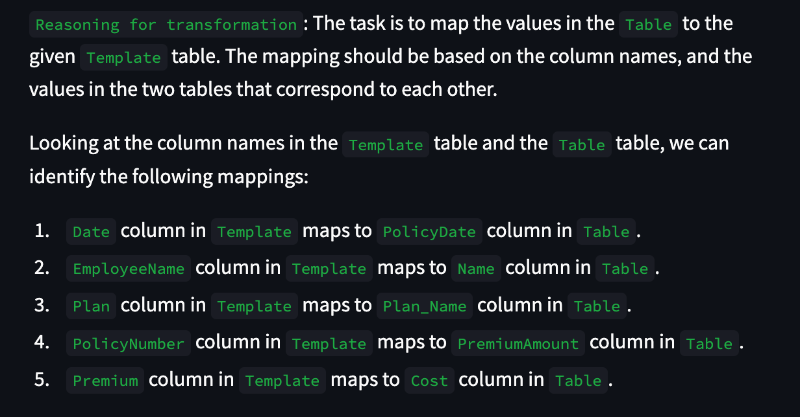

# table-template-matcher
GPT3.5 based template matcher for two CSV files

## Description

This project is a proof of concept for a GPT3.5 based template matcher for two CSV files. The user uploads two CSV files and provides a reason for the transformation. The GPT3.5 model then generates a Python script that transforms the first CSV file into the second CSV file. The user can then test the generated Python script and the transformed CSV file.

## App Demo
Please use `template.csv`, `table_A.csv` and `table_B.csv` for testing the app which is given
in this repo. 

You can find it here: https://template-matcher-prototype.streamlit.app/


## Requirements

- Python 3.8
- [OpenAI API key](https://beta.openai.com/)
- streamlit==1.14.0
- numpy==1.24.4
- pandas==2.0.3
- openai==0.27.8

## Installation

```bash
pip install -r requirements.txt
```

## Usage

```bash
streamlit run main.py
```

## User Interface

1. File Upload

2. Reason for Transformation

3. Code

4. Transformed Table

5. Issues


## Future work / Possible improvements
1. Improve the GPT3.5 model by instruction fine-tuning
2. Add a Re-Act Framework using Langchain, but seemed like an overkill here.
3. Using vector embeddings to serve as long term memory. This would help in cases where the user wants to transform multiple tables in a single session.